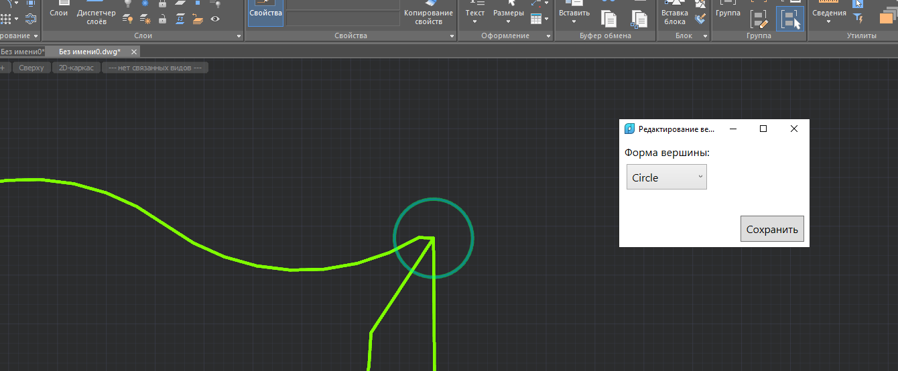
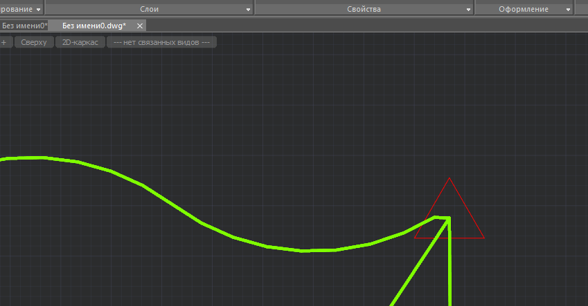

# Общее

Класс нахождения кратчайшего пути покрыт тестами.

# Команды

GB_CREATE_GRAPH_VERTEX - создать точку графа. Точки создаются последовательно.

GB_CREATE_GRAPH_EDGE - создание ребра между точками.

GB_FIND_SHORTEST_WAY - поиск и выделение кратчайшего пути по 2-м вершинам.

GB_CLEAR_SHORTEST_WAY - очистка выделения кратчайшего пути.

# Ошибки

# Использование

Редактирование вида вершины - двойным кликом по вершине.

