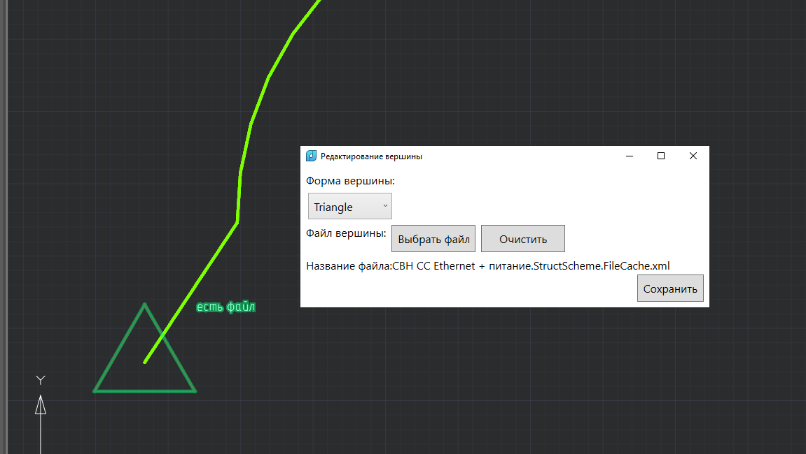

# Общее

Класс нахождения кратчайшего пути покрыт тестами.

# Команды

GB_CREATE_GRAPH_VERTEX - создать точку графа. Точки создаются последовательно.

Можно добавлять файл:

GB_CREATE_GRAPH_EDGE - создание ребра между точками.

GB_FIND_SHORTEST_WAY - поиск и выделение кратчайшего пути по 2-м вершинам.

GB_CLEAR_SHORTEST_WAY - очистка выделения кратчайшего пути.

GB_EDIT_GRAPH_EDGE_STYLE - редактирование стиля линий.

# Ошибки

- Есть фатальная ошибка при удалении ребра: пока не удалось отладить чтобы понять, почему после удаления ребра и закрытия dwg может упасть nanocad.

MultiCAD лог не обрабатывает и log не выдает.

# Использование

Редактирование вида вершины - двойным кликом по вершине.
